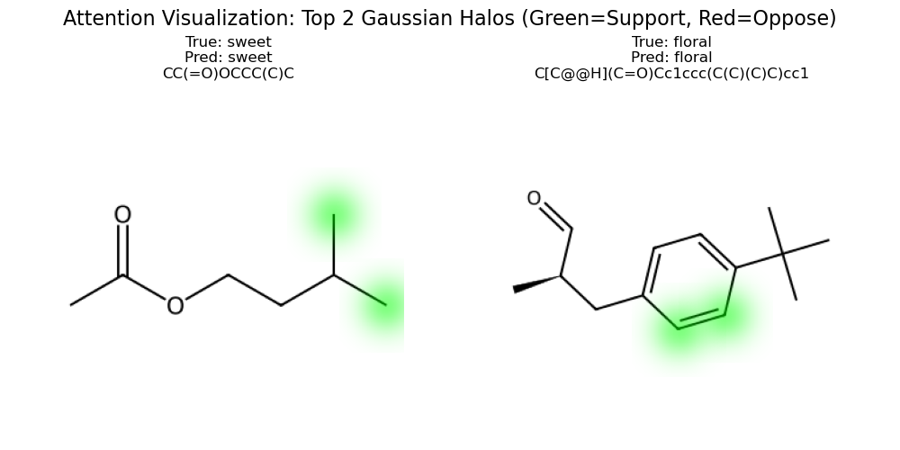
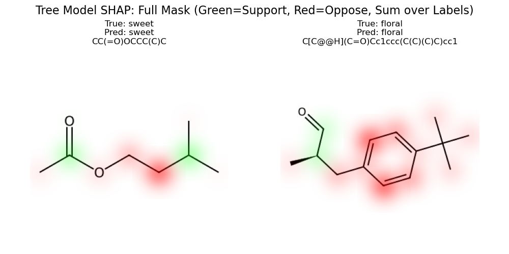

# Smell Prediction

**Multi-label odor classification using ChemBERTa and traditional ML approaches**

Understanding odour begins with chemistry: smell arises when volatile molecules bind to olfactory receptors based on their 3D structure and functional groups. This structure–activity relationship is central to predicting scent from molecular data. While state-of-the-art results are currently led by large models like Mol-PECO and Google’s neural odour map, this project draws inspiration from the recently published FART (Flavor Analysis and Recognition Transformer), which achieved strong performance in flavour prediction by fine-tuning ChemBERTa. I adopt a similar transformer-based approach for odour classification, and compare its performance to LightGBM and XGBoost, two widely used gradient boosting models known for their strong results in cheminformatics tasks.

---

## 🎯 **Overview**

This project implements a complete pipeline for predicting multiple odor labels from molecular structures. We use two complementary approaches:

1. **ChemBERTa + LoRA**: Parameter-efficient fine-tuning of a chemical language model
2. **Traditional ML**: LightGBM/XGBoost with molecular fingerprints and descriptors

Both approaches handle the multi-label nature of odor prediction, where molecules can exhibit multiple odor characteristics simultaneously.

---

## 📊 **Dataset**

- **Source**: Filtered splits from pyrfume-data, containing only molecules with at least one of the four target odor labels: sweet, floral, mint, pungent.
- **Files**: 
  - `data/pyrfume_train_4odors.csv`
  - `data/pyrfume_val_4odors.csv`
  - `data/pyrfume_test_4odors.csv`
- **Columns**:
  - `SMILES`: Canonical SMILES string for each molecule
  - `sweet`, `floral`, `mint`, `pungent`: Binary columns (1 = label present, 0 = absent)
- **Format**: Multi-label classification (molecules can have 1-4 labels)

### Example row:
| SMILES | sweet | floral | mint | pungent |
|--------|-------|--------|------|---------|
| CCOC(=O)CCC(=O)OCC | 1 | 0 | 0 | 0 |

### Label Distribution (train set):
- **Total molecules**: 2099
- **Sweet**: 799 (38.1%)
- **Floral**: 1249 (59.5%)
- **Mint**: 229 (10.9%)
- **Pungent**: 91 (4.3%)


---

## 🚀 **Quick Start**

### 1. Setup Environment
```bash
conda create -n scent-env python=3.10
conda activate scent-env
pip install -r requirements.txt
```

### 2. Run ChemBERTa Fine-tuning
```bash
# Local training, see the script for the full list of arguments
python chemberta_odor_finetuning.py --epochs 10 --seed 42

```

### 3. Run Traditional ML Pipeline
```bash
# Both LightGBM and XGBoost
python ml_odor_classification.py --models lightgbm xgboost --seed 42

# With GPU acceleration (HuggingFace)
python ml_odor_classification.py --models lightgbm xgboost --gpu --seed 42

# Custom molecular features
python ml_odor_classification.py --morgan_bits 4096 --seed 42
```

---

## Project Structure

The repository is organized as follows:

```
smell-pred/
├── data/                      # All CSV data files (e.g., pyrfume_train_4odors.csv, pyrfume_test_4odors.csv, ...)
├── scripts/                   # All Python scripts for training, evaluation, ML baselines, and visualization
│   ├── chemberta_odor_finetuning.py   # Training script for ChemBERTa LoRA
│   ├── chemberta_odor_predict.py      # Inference script for ChemBERTa LoRA (standard & ensemble)
│   ├── ml_odor_classification.py
│   ├── visualize_attention.py
│   ├── visualize_shap_tree.py
│   ├── convert_pyrfume_to_4odors.py
│   └── chemberta_odor_eval_plots.py
├── chemberta_lora_results/    # Output directory for ChemBERTa LoRA fine-tuning results and plots
│   ├── final_model/           # Saved model and tokenizer
│   ├── predictions_ensemble.csv   # Example output from ensemble inference
│   └── ...
├── chemberta_lora_logs/       # Output directory for training logs (TensorBoard, etc.)
├── ml_odor_results/           # Output directory for ML baseline results and plots
├── pyrfume-data/              # (Optional) Additional raw data resources
├── explore_bushdid_chemberta.ipynb   # Jupyter notebook for data exploration
├── requirements.txt           # All pip dependencies for the project
├── README.md
└── ... (other directories and files)
```

- **All scripts** are in `scripts/`.
- **All data files** are in `data/`.
- **Output directories** (`chemberta_lora_results/`, `ml_odor_results/`) contain all plots and results.
- **Jupyter notebooks** remain in the project root for easy access.
- **Raw datasets** are in `pyrfume-data/`.
- **Ensemble predictions** are saved in `chemberta_lora_results/predictions_ensemble.csv`.

Update your script paths accordingly if you add new data or scripts.

---

## **ChemBERTa Approach**

### Model Architecture
- **Base Model**: `seyonec/SMILES_tokenized_PubChem_shard00_160k` (ChemBERTa)
- **Fine-tuning**: LoRA (Low-Rank Adaptation) for efficiency
- **Parameters**: Only 1.05% of model parameters trained (888K vs 83M)
- **Output**: 4 sigmoid neurons for multi-label classification
- **Loss**: Binary Cross-Entropy with class weights for imbalance


### Training Configuration
```python
NUM_EPOCHS = 8
BATCH_SIZE = 8  
LEARNING_RATE = 1e-3
LORA_R = 16
WARMUP_STEPS = 100
```

---

## 🧪 Ensemble Inference with Synonymous SMILES

We implemented an ensemble inference approach inspired by recent literature, where for each molecule, multiple synonymous SMILES representations are generated using RDKit. The trained ChemBERTa LoRA model predicts on each of these SMILES, and the results are aggregated using a voting procedure. This provides a confidence metric for each prediction and can make the model more robust to SMILES representation variability. In our experiments, this ensemble method sometimes improved certain metrics, but did not substantially outperform the standard LoRA ChemBERTa approach overall.

**Script:**
- The ensemble inference is implemented in [`scripts/chemberta_odor_predict.py`](scripts/chemberta_odor_predict.py).

**How to run:**

- **Standard (single SMILES) inference:**
  ```bash
  python scripts/chemberta_odor_predict.py \
      --model_path chemberta_lora_results/final_model \
      --input data/pyrfume_test_4odors.csv \
      --output chemberta_lora_results/predictions_single.csv
  ```

- **Ensemble (synonymous SMILES) inference:**
  ```bash
  python scripts/chemberta_odor_predict.py \
      --model_path chemberta_lora_results/final_model \
      --input data/pyrfume_test_4odors.csv \
      --output chemberta_lora_results/predictions_ensemble.csv \
      --ensemble \
      --n_ensemble 10 \
      --find_threshold
  ```

- The output CSV will include predictions, probabilities, confidence scores, and (if ground truth is present) all relevant metrics printed to the console.

---

## **Traditional ML Approach**

### Feature Engineering
- **Morgan Fingerprints**: 2048-bit molecular fingerprints
- **RDKit Descriptors**: Molecular weight, LogP, H-bond donors/acceptors, TPSA, etc.
- **Feature Count**: 2048 + 10 = 2058 features total

### Models
- **XGBoost**/**LightGBM**: Gradient boosting with CUDA support  
- **Multi-Output**: Separate binary classifier for each odor label

### Key Features
- ✅ **GPU Acceleration**: Both LightGBM and XGBoost support GPU
- ✅ **Class Weights**: Handles imbalanced data
- ✅ **Fast Training**: Much faster than deep learning approaches
- ✅ **Interpretable**: Feature importance analysis
- ✅ **Multi-Label Analysis**: Label co-occurrence and correlation analysis

---

## 📈 **Results & Performance** (the 🏆 indicates the best score out of the 3 models)

🏆 **Model Leaderboard**

| 🥇 Rank | Model           | N  🏆 |
|--------|------------------|----------|
| 🥇 1st | XGBoost    | 10     | 
| 🥈 2nd | LightGBM | 8    |
| 🥉 3rd | ChemBERTa + LoRA       | 7    | 
        

### ChemBERTa LoRA Results (7 🏆)

| Metric | Score |
|--------|-------|
| Macro F1 | **0.6536** 🏆 |
| Micro F1 | **0.8263** 🏆 |
| Exact Match | 0.5382 |
| Hamming Loss | 0.1737 |

| Class | Precision | Recall | F1 | ROC-AUC | PR-AUC |
|-------|-----------|--------|----|---------| -------|
| Sweet | 0.6119 | 0.4059 | 0.4881 | 0.7149 | 0.6155 |
| Floral | 0.7348 | 0.8526 | 0.7893 | 0.7741 | 0.8006 |
| Mint | 0.7143 | 0.5172 | 0.6000 | 0.8717 | 0.6174 |
| Pungent | **0.8750** 🏆 | **0.6363**  🏆| **0.7368** 🏆 | **0.9710** 🏆 | **0.7441** 🏆 |


### LightGBM Results (8 🏆)

| Metric | Score |
|--------|-------|
| Macro F1 | 0.6395 |
| Micro F1 | 0.7427 |
| Exact Match | 0.5802 |
| Hamming Loss | 0.1422 |

| Class     | Precision | Recall | F1    | ROC-AUC | PR-AUC |
|-----------|-----------|--------|-------|---------|--------|
| Sweet    | 0.6200      | **0.7500** 🏆   | **0.6169** 🏆  | **0.7481** 🏆    | 0.6948   |
| Floral   | **0.8418** 🏆      | 0.6139   | 0.8471  | **0.8634** 🏆    | **0.8886** 🏆   |
| Mint     | 0.8500      | **0.8526** 🏆   | 0.6939  | 0.8637    | 0.7281   |
| Pungent  | **0.7500**  | 0.2727   | 0.4000  | 0.9008    | 0.5297   |


### XGBoost Results (10 🏆)

| Metric | Score |
|--------|-------|
| Macro F1 | 0.6480 |
| Micro F1 | 0.7521 |
| Exact Match | **0.5916** 🏆 |
| Hamming Loss | **0.1384** 🏆 |

| Class     | Precision | Recall | F1    | ROC-AUC | PR-AUC |
|-----------|-----------|--------|-------|---------|--------|
| Sweet     | **0.6224** 🏆      | 0.6039   | 0.6131  | 0.7421    | **0.7118** 🏆   |
| Floral    | 0.8405      | **0.8782** 🏆   | **0.8589** 🏆  | 0.8585    | 0.8727   |
| Mint     | **0.8636** 🏆      | 0.6552   | **0.7451** 🏆  | **0.8832** 🏆    | **0.7326** 🏆   |
| Pungent   | 0.6000      | 0.2727   | 0.3750  | 0.9243   | 0.5252   |


---

## 🎨 **Visualizations**

Both approaches generate comprehensive plots:

### ChemBERTa Plots
- **ROC Curves**: Per-class ROC-AUC analysis
- **Precision-Recall Curves**: PR-AUC for imbalanced classes
- **Training History**: Loss curves, F1 scores, learning rate schedule
- **Performance Summary**: Class distribution and metrics comparison

### Traditional ML Plots  
- **Model Comparison**: F1 scores across LightGBM vs XGBoost
- **Per-Class Performance**: ROC-AUC and F1 by odor class
- **Multi-Label Analysis**: Label co-occurrence, correlation matrix
- **Error Distribution**: Hamming distance and prediction complexity

### Decision Visualization
Through the scripts visualize_attention.py and visualize_shap_tree.py, we can visualize the main contributors to the model label predictions.
The left molecule is Isopentyl acetate (also known as isoamyl acetate); the odor is sweet, fruity, commonly known as the smell of banana or pear; and the ester group is known to contribute strongly to the sweet/fruity smell.
The right molecule is a chiral derivative of phenylbutanoate with a tert-butyl group on the phenyl ring; the Aromatic ring, ketone side chain, and chiral centers are usually associated with floral/fragrant characteristics.

<div align="center">
  
  <br/>
  
</div>

---

## 🔬 **Multi-Label Handling**

Both approaches properly handle the multi-label nature of odor prediction:

### ChemBERTa Approach
- **Independent Predictions**: Each label predicted independently
- **Sigmoid Outputs**: Can predict multiple labels per molecule
- **BCE Loss**: Binary cross-entropy for each label
- **Class Weights**: Address label imbalance (pungent: 15.4x weight)

### Traditional ML Approach
- **MultiOutputClassifier**: Separate binary classifier per label
- **Label Analysis**: Co-occurrence patterns and correlations
- **Imbalance Handling**: Class weights and evaluation metrics
- **Pattern Detection**: Most common label combinations

---

## 🔧 **Advanced Usage**

### Custom ChemBERTa Training
```bash
# Extended training with custom parameters
python chemberta_odor_finetuning.py \
    --epochs 8 \
    --batch_size 8 \
    --learning_rate 1e-4 \
    --lora_r 16 \
    --seed 42
```

### Custom ML Pipeline
```bash
# Custom feature engineering
python ml_odor_classification.py \
    --models lightgbm \
    --morgan_bits 4096 \
    --no_features \
    --seed 42
```

### Prediction on New Molecules
```bash
# Use trained ChemBERTa model
python chemberta_odor_predict.py \
    --model_path ./chemberta_lora_results/final_model \
    --input new_molecules.csv \
    --output predictions.csv
```

---

## 💡 **Key Insights**

- **Traditional ML** provides faster training and better performance in most metrics, with added interpretability
- **ChemBERTa excels** at capturing complex molecular patterns, but probably only the fully fine-tuned model would perform better than the tree-based models
- **Multi-label prediction** is challenging due to label imbalance
- **Class weights** are crucial for minority classes (mint, pungent)

---

## 🔄 **Reproducibility**

### Fixed Seeds
- Python random: 42
- NumPy: 42  
- PyTorch: 42
- Model training: 42

### Environment
```bash
# Complete environment setup
conda env create -f environment.yml
conda activate scent-env
```

### Data Splits
- Consistent train/test splits stored in CSV files
- All preprocessing steps documented and reproducible

---

## 📝 **Future Improvements**

### Model Enhancements
- [ ] Fully fine-tune ChemBERTa
- [ ] Try graph-based models, or an ensemble of models
      
### Data Augmentation
- [ ] Semi-supervised learning with unlabeled molecules
- [ ] Additional odor classes and datasets

### Deployment
- [ ] REST API for real-time predictions
- [ ] Integration with molecular design tools

---

## 📚 **References**

- **FART**: [Zimmermann et al., (2025)](https://chemrxiv.org/engage/chemrxiv/article-details/6756f9777be152b1d06b2175)
- **ChemBERTa**: [Chithrananda et al., (2020)](https://arxiv.org/abs/2010.09885)
- **LoRA**: [Hu et al., (2021)](https://arxiv.org/abs/2106.09685) 
- **Pyrfume**: [Sanchez-Lengeling et al., (2019)](https://arxiv.org/abs/1910.10685)
- **RDKit**: [Landrum, G. (2006)](https://www.rdkit.org/)


---

## 📄 **License**

MIT License - see [LICENSE](LICENSE) file for details.

---


## Viewing Training Curves with TensorBoard

When you run the ChemBERTa fine-tuning script, training and validation loss curves (and other metrics) are automatically logged to the `chemberta_lora_logs/` directory using TensorBoard format.

To view these plots:

1. **Install TensorBoard** (if you haven't already):
   ```bash
   pip install tensorboard
   # or, with conda:
   conda install -c conda-forge tensorboard
   ```

2. **Start TensorBoard** from your project root:
   ```bash
   tensorboard --logdir chemberta_lora_logs
   ```

3. **Open your browser** and go to [http://localhost:6006/](http://localhost:6006/)

4. **Navigate to the 'Scalars' tab** to see plots for:
   - `loss` (training loss)
   - `eval_loss` (validation loss)
   - Other metrics (F1, accuracy, etc.)

You can zoom, pan, and download the plots as images for your reports or presentations.

If you don't see any plots, make sure your script has finished running and that logs exist in the `chemberta_lora_logs/` directory.


